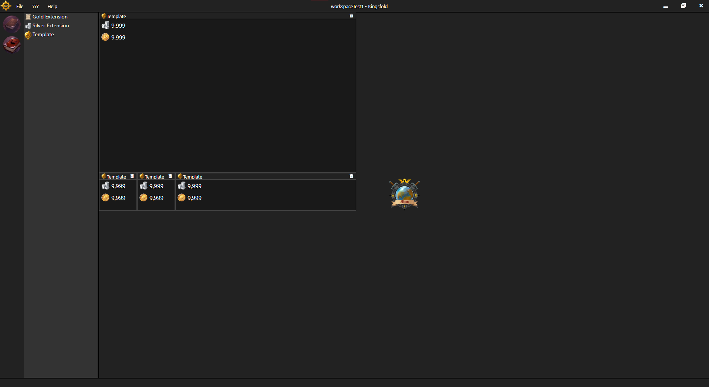

### Attention
This client is extremely early, still a work in progress.

Right now, I'm working on getting the core functions working.
Later I will expand upon extensions so the client can be extended and used properly.

### Features
- The client will be highly extendable through extensions. You can see some test extensions open as "Template" in the screenshot below.
- The client will save your extension layouts as workspaces. You can see 2 test workspaces listed as bubbles on the left of the screenshot below.
- Extensions can listen for packets coming in from `tcc-sniffer`.
- Extensions will have access to many AO images, item data, etc.

### Screenshots

### Trying Out

You can play with the source if you know what you're doing.
We use nodejs and electron.
You'll also need to check out `tcc-sniffer` to build the exe, placing it in the root folder here.

For everyone else, there is an installer here [releases].
Remember this is just to try out, not to use it.